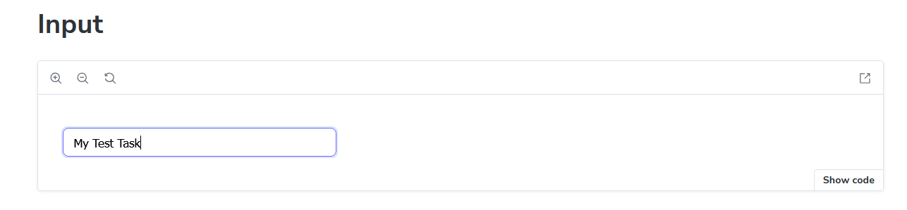
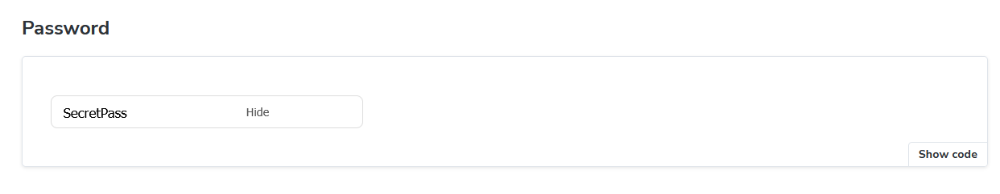
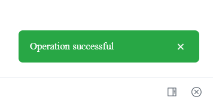
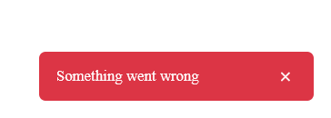
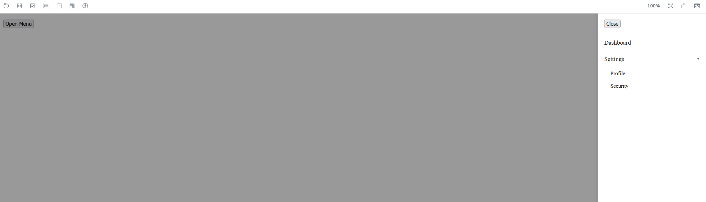

# Storybook UI Component System

A small UI component system built with React, TypeScript and Storybook.


## Setup

```bash
npm install
npm run storybook
```
## Components

### Input

Features:
- Supports multiple types (text, password, number)
- Password visibility toggle
- Optional clear button
- Fully controlled / uncontrolled support

---

### Toast

Features:
- Bottom-right positioning
- Auto-dismiss with configurable duration
- Variants: success, error, info, warning
- Optional manual close button
- Slide-in animation

---

### Sidebar Menu

Features:
- Slides in from the right
- Overlay background click to close
- Nested expandable items
- Animated submenu
- Basic accessibility support

## Screenshots

### Input



### Toast



### Sidebar
